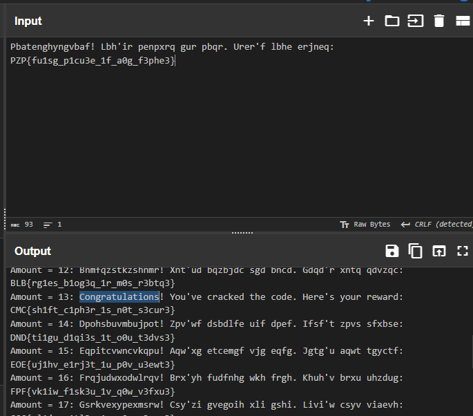

this was an easy one take the encrypted message and use cyberchef , brute force the key and you will find the solve 




```bash
nc 139.59.162.57 9999

██████╗ ██╗███╗   ███╗██████╗ ██╗     ███████╗███████╗██╗  ██╗██╗███████╗████████╗███████╗██████╗ 
██╔════╝██║████╗ ████║██╔══██╗██║     ██╔════╝██╔════╝██║  ██║██║██╔════╝╚══██╔══╝██╔════╝██╔══██╗
███████╗██║██╔████╔██║██████╔╝██║     █████╗  ███████╗███████║██║█████╗     ██║   █████╗  ██████╔╝
╚════██║██║██║╚██╔╝██║██╔═══╝ ██║     ██╔══╝  ╚════██║██╔══██║██║██╔══╝     ██║   ██╔══╝  ██╔══██╗
███████║██║██║ ╚═╝ ██║██║     ███████╗███████╗███████║██║  ██║██║██║        ██║   ███████╗██║  ██║
╚══════╝╚═╝╚═╝     ╚═╝╚═╝     ╚══════╝╚══════╝╚══════╝╚═╝  ╚═╝╚═╝╚═╝        ╚═╝   ╚══════╝╚═╝  ╚═╝
                                                                                                   
Can you decode the secret message?

Welcome to SimpleShifter!

I've hidden a secret message containing a flag.
The message has been encrypted using a substitution cipher.
Your task is to figure out how to decrypt it.

The encrypted message is below:

Encrypted message: Pbatenghyngvbaf! Lbh'ir penpxrq gur pbqr. Urer'f lbhe erjneq: PZP{fu1sg_p1cu3e_1f_a0g_f3phe3}
```