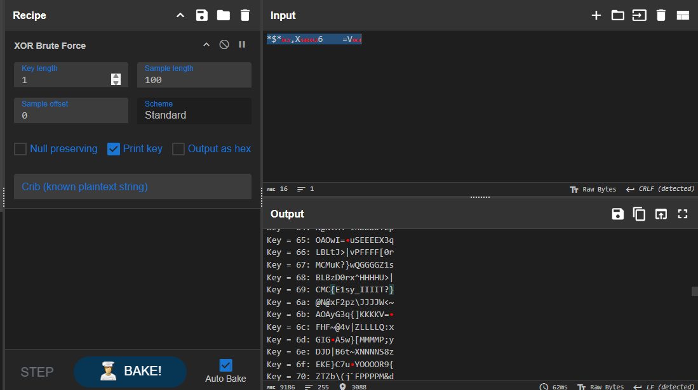

## Description

Can you decrypt this [cipher](./cipher.txt)?

* The challenge name suggests it should be easy.
* No complex encryption algorithms were used.
* Sometimes, the simplest method is the right one.

## Note

I created this as a beginner-friendly crypto challenge to help participants learn basic cipher techniques. Solving it requires trying common decryption methods, not advanced cryptography.

We can see the key was `69`, and the flag is:
`CMC{E1sy_IIIIT?}`

However, I made a mistake when creating the challenge — I copied the encrypted data instead of downloading it. Because of this, the flag appeared incorrectly as `CMC{E1sy_IIIIT?}`.

The correct flag was actually:
**`CMC{E1sy_InIIT?}`**

During the challenge, I fixed the mistake, and all participants who solved it were given the correct flag.
