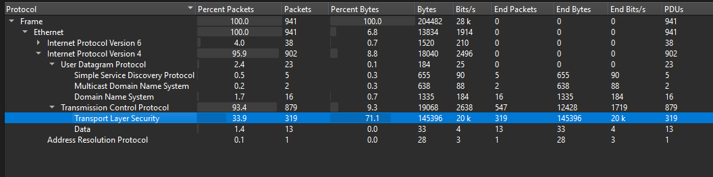
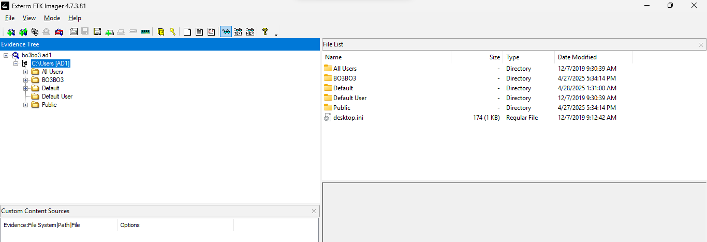
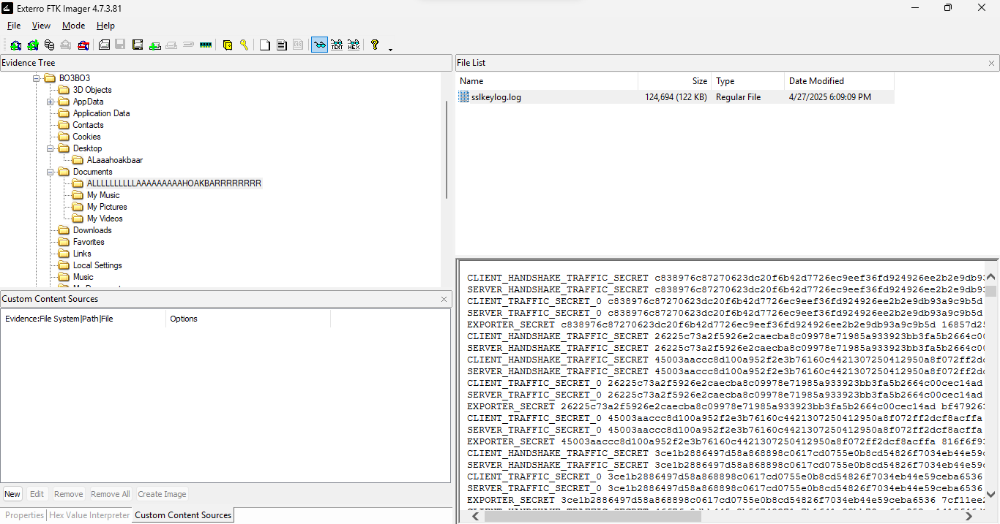
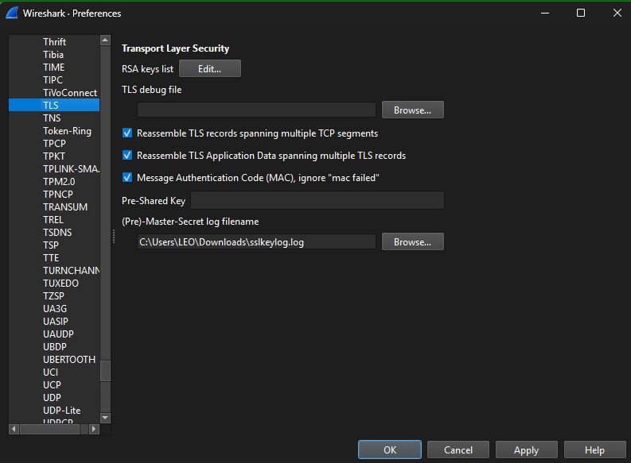
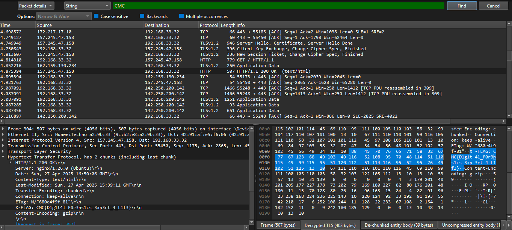

### Challenge Details
- **Category**: Network Forensics
- **Difficulty**: Medium

In the depths of a chaotic network environment, hidden communications and encrypted secrets flow among the noise. Your task is to analyze the provided capture file, reconstruct key evidence, and uncover the truth behind the suspicious activities. Only a true master of digital forensics will be able to piece together the scattered traces and retrieve the hidden flag.

### Requirements
- Packet analysis proficiency
- Protocol understanding (HTTP, SSL, TCP/IP)
- Basic cryptography knowledge
- Attention to detail

---

*Author: xtle0o0*

https://www.mediafire.com/file/js2ykpou4mt66xi/bo3bo3i.zip/file

Participants were provided with a link to a zip file containing a bo3bo3.ad1 file and a capture.pcapng. Based on the description, we can see "encrypted secrets," suggesting the flag has been sent via a secure protocol. The requirements indicate we need understanding of HTTP, SSL, and TCP/IP. Things are starting to become clear.

Let's examine the traffic capture first.

Looking through the protocols hierarchy in TCP, we can see that we have TLS: 
 

Let's check the image file: 
 

As we can see, we have a user named BO3BO3.

Let's navigate through the file system and see if we can find something to decrypt the traffic.

Checking Documents, we find a subdirectory inside it containing a sslkeylog.log file: 

By extracting the log file and going to Wireshark, we can use it to decrypt traffic by going to Edit > Preferences > Protocols > TLS and choosing the sslkeylog as Pre-master secret log filename. This gives us our decrypted file:

After clicking Apply, we get a new protocol "HTTP".

To save time, filter for the flag using "CMC", and you will find the flag in headers that were sent to 192.168.33.32 when the user visited http://157.245.47.158:

flag: `CMC{D1g1t4l_F0r3ns1cs_3xp3rt_4_L1f3}`