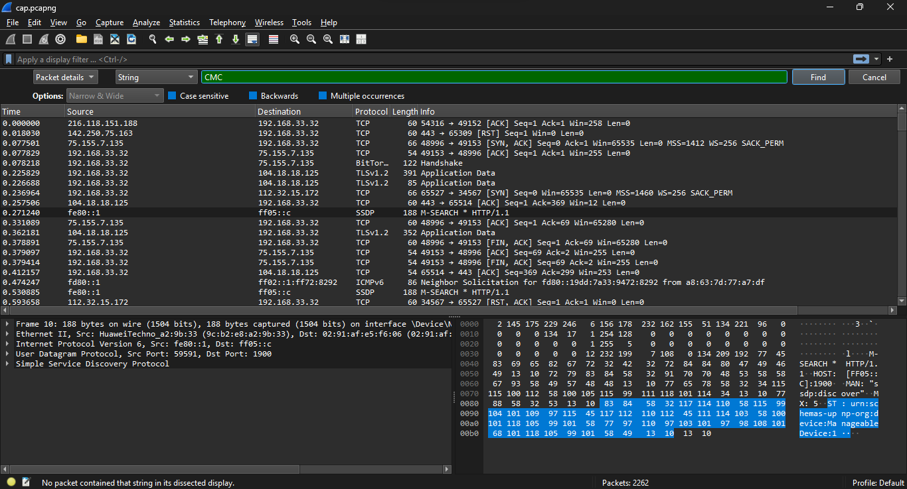

## Challenge Details
- **Category**: Forensics
- **Difficulty**: Medium

## Description
A messy network capture hides plain-text credentials, a secret link, and a folder full of files. Your job is to look through the packets, find the hidden link, and follow it to download the folder. Inside are many fake flags and one real one. Can you find the true flag?

## Requirements
- Knowledge of packet analysis with Wireshark
- Understanding of basic TCP/IP sessions
- Ability to search files for specific patterns
- Attention to detail for identifying the correct flag


*Author: xtle0o0*

---

## Solution

### Step 1: Initial Analysis of the PCAP File

Upon examining the PCAP file, we begin by analyzing the protocol hierarchy to get an overview of the network traffic:


We observe multiple protocols in the capture, including TLS, Telnet, BitTorrent, and DNS. 

### Step 2: Looking for Easy Clues

First, we try searching for the flag pattern directly in the packet details:



Wireshark doesn't find any direct matches, so we continue our investigation.

### Step 3: Analyzing DNS Traffic

Next, we check DNS traffic to see if there are any suspicious domain lookups:


The DNS lookups appear to be normal, mostly Microsoft-related domains. Nothing suspicious stands out.

### Step 4: Focusing on Unencrypted Traffic

Since the challenge description mentions "plain-text credentials," we should focus on unencrypted protocols. Telnet, being notoriously insecure, is a perfect candidate for investigation:


The Telnet capture shows a connection established between 192.168.33.32 and 157.245.47.158.

### Step 5: Extracting Credentials

Looking at the data transmitted over Telnet, we notice two suspicious strings:

First part (username):


The string is: `aHR0cHM6Ly93d3cubWVkaWFmaXJlLmNvbS9maWxlL2`

Second part (password):
`o3N3dlMjE5cmxoY2J2cC9maW5kbWUuemlwL2ZpbGU`

### Step 6: Decoding the Data

When we combine the two parts:
```
aHR0cHM6Ly93d3cubWVkaWFmaXJlLmNvbS9maWxlL2o3N3dlMjE5cmxoY2J2cC9maW5kbWUuemlwL2ZpbGU
```

This appears to be Base64 encoded. Decoding reveals a MediaFire download link:


The link is: `https://www.mediafire.com/file/j77we219rlhcbvp/findme.zip/file`

### Step 7: Downloading and Extracting the ZIP File

After downloading and extracting the ZIP file, we find numerous text files:


Each file contains multiple flag-like strings. We need to search through them systematically.

### Step 8: Finding the Real Flag

We can use grep to search for the flag format "CMC" across all files:

```bash
┌──(kali㉿kali)-[~/Desktop/citeflag/DFIR]
└─$ grep -E 'CMC' *
file_01.txt:CMC{CCSDCSDur3d_TSCSDCn3t_DCSd3nti@ls_F0sf@t@}
file_01.txt:CMC{CCSCDSJB@ls_Unl0csd@sure}
file_02.txt:CMC{S3crCSDC_sd3d_InfCQ}
file_02.txt:CMC{S3crCSDC_sdD1sc0v3r3d}
file_02.txt:CMC{CCSCDSJB@ls_Unl0csd@sure}
file_02.txt:CMC{D@t@C@ch_sd3d_InfCQ}
file_03.txt:CMC{CCSDCSDur3d_TSCSDCn3t_DCSd3nti@ls_sdD1sc0v3r3d}
file_04.txt:CMC{CCSCDSJB@ls_sdD1sc0v3r3d}
file_05.txt:CMC{CCSDCSDur3d_TSCSDCn3t_DCSd3nti@ls_sdD1sc0v3r3d}
file_06.txt:CMC{CSDC_P@ssw0rds_H1ddcse}
file_07.txt:CMC{D@t@C@ch_H1ddcse}
file_09.txt:CMC{D@t@C@ch_H1ddcse}
file_10.txt:CMC{CCSDCSDur3d_TSCSDCn3t_DCSd3nti@ls_sd3d_InfCQ}
file_10.txt:CMC{CCSDCSDur3d_TSCSDCn3t_DCSd3nti@ls_Unl0csd@sure}
file_10.txt:CMC{CCSDCSDur3d_TSCSDCn3t_DCSd3nti@ls_sdD1sc0v3r3d}
file_10.txt:CMC{C4ptur3csdcYCDYICd_SSH_Cr3d3ntiCGDSTUGCD@ls_sdD1sc0v3r3d}
file_11.txt:CMC{CCSDCSDur3d_TSCSDCn3t_DCSd3nti@ls_sdD1sc0v3r3d}
file_11.txt:CMC{D@t@C@ch_sdD1sc0v3r3d}
file_11.txt:CMC{CSDC_P@ssw0rds_Unl0csd@sure}
file_12.txt:CMC{C4ptur3csdcYCDYICd_SSH_Cr3d3ntiCGDSTUGCD@ls_sdD1sc0v3r3d}
file_13.txt:CMC{P@CSD0rd_L3@k_sdD1sc0v3r3d}
file_13.txt:CMC{CSDC_P@ssw0rds_sdD1sc0v3r3d}
file_13.txt:CMC{CSDC_P@ssw0rds_F0sf@t@}
file_14.txt:CMC{CCSCDSJB@ls_sdD1sc0v3r3d}
file_14.txt:CMC{C4ptur3csdcYCDYICd_SSH_Cr3d3ntiCGDSTUGCD@ls_H1ddcse}
file_14.txt:CMC{CCSCDSJB@ls_sdD1sc0v3r3d}
file_14.txt:CMC{C4ptur3csdcYCDYICd_SSH_Cr3d3ntiCGDSTUGCD@ls_Unl0csd@sure}
file_15.txt:CMC{S3crCSDC_F0sf@t@}
file_15.txt:CMC{CSDC_P@ssw0rds_sd3d_InfCQ}
file_16.txt:CMC{P@CSD0rd_L3@k_sdD1sc0v3r3d}
file_16.txt:CMC{CSDC_P@ssw0rds_H1ddcse}
file_16.txt:CMC{CSDC_P@ssw0rds_sd3d_InfCQ}
file_17.txt:CMC{D@t@C@ch_F0sf@t@}
file_17.txt:CMC{CCSDCSDur3d_TSCSDCn3t_DCSd3nti@ls_sd3d_InfCQ}

```

The command returns many results. Most flags look similar with random characters, but one stands out in file_34.txt:

```
file_34.txt:CMC{C4ptur3d_T3ln3t_Cr3d3nti@ls_Unl0ck3d_Tr3@sure}
```

This flag is properly formatted with readable leet-speak text that matches the challenge theme of capturing Telnet credentials, making it the only valid flag among the decoys.

## Conclusion

This forensic challenge required:
1. Analyzing network traffic to find suspicious communications
2. Identifying and focusing on unencrypted protocols (Telnet)
3. Decoding Base64-encoded data to discover a hidden link
4. Downloading and systematically searching through multiple files
5. Distinguishing the real flag from numerous decoys

The final flag is: `CMC{C4ptur3d_T3ln3t_Cr3d3nti@ls_Unl0ck3d_Tr3@sure}`
