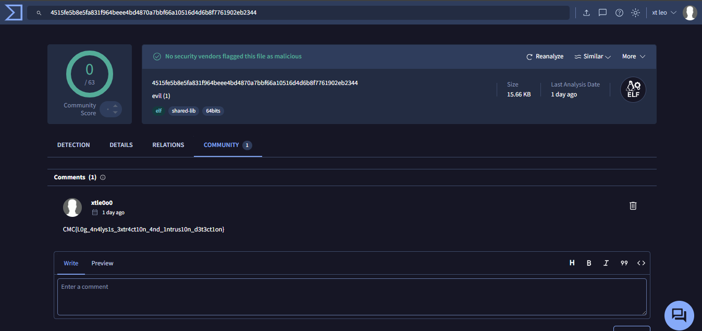

## Challenge Details
- **Category**: Forensics
- **Difficulty**: Medium

## Description

The Security Operations Center heard a faint whisper of intrusion—logs fragmented, entries erased, yet one solitary `curl` command survives, hinting at a clandestine download. Somewhere in the tangled trails of host and proxy logs lies the path to a hidden script. Retrieve it from its Git refuge, unveil its secrets, and claim the flag concealed in plain sight.


*Author: xtle0o0*

---

## Solution

### Step 1: Initial Log Analysis

The challenge provides us with a log file. After reading the description, we understand that something was downloaded from the internet. Let's check for HTTP/HTTPS URLs in the logs:

```bash
┌──(kali㉿kali)-[~/Desktop/citeflag/DFIR]
└─$ grep -E 'http[s]?://' logs.txt  
[2023-07-15T10:05:33.145Z] INFO  [process] New process started: /usr/bin/curl -O https://github.com/yohannesfitsumgidey/forensics-master/raw/refs/heads/main/evil
```

We found a single URL in the logs. This shows a curl command that downloaded a file named "evil" from a GitHub repository.

### Step 2: Downloading and Initial Analysis

Let's download the file and examine it:

```bash
┌──(kali㉿kali)-[~/Desktop/citeflag/DFIR]
└─$ file evil 
evil: ELF 64-bit LSB pie executable, x86-64, version 1 (SYSV), dynamically linked, interpreter /lib64/ld-linux-x86-64.so.2, BuildID[sha1]=9e0f590374ea5b8c495fb3a052a2e0dc4c1b42a6, for GNU/Linux 3.2.0, not stripped
```

The file is an ELF 64-bit executable. Let's check for any interesting strings in the binary:

```bash
┌──(kali㉿kali)-[~/Desktop/citeflag/DFIR]
└─$ strings evil                                  
/lib64/ld-linux-x86-64.so.2
{"type":"deb","os":"ubuntu","name":"glibc","version":"2.40-1ubuntu3.1","architecture":"amd64"}
puts
__libc_start_main
__cxa_finalize
libc.so.6
GLIBC_2.2.5
GLIBC_2.34
_ITM_deregisterTMCloneTable
__gmon_start__
_ITM_registerTMCloneTable
PTE1
u+UH
Hello, World! This program does nothing malicious.
# ... [truncated for brevity] ...
```

### Step 3: Decompiling the Binary

Let's decompile the binary to understand its functionality:


After analyzing the main function, we can see it's just a simple "Hello World" program that prints a message claiming to be harmless. This is a dead-end for most participants.

### Step 4: The Unconventional Approach

Looking at the challenge name "Virus Khatir," the word "virus" suggests we should check for malware indicators. Let's calculate the file's hash and check it on VirusTotal:

```bash
┌──(kali㉿kali)-[~/Desktop/citeflag/DFIR]
└─$ sha1sum evil 
0e1b6160c6a851205103921315717bd6a7b2c899  evil
```

### Step 5: VirusTotal Analysis

When checking the hash on VirusTotal, we see the file is clean:


The program doesn't have any suspicious behaviors or communications. However, the challenge has an unexpected twist...

### Step 6: Finding the Flag

If you explore the VirusTotal community section, you'll find the flag 



## Conclusion

This challenge demonstrated that sometimes the solution isn't found through conventional forensic analysis but through creative thinking and exploring all available resources. The flag was hidden "in plain sight" but in a place most analysts wouldn't immediately think to look - the VirusTotal community section.

flag: `CMC{L0g_4n4lys1s_3xtr4ct10n_4nd_1ntrus10n_d3t3ct1on}`
