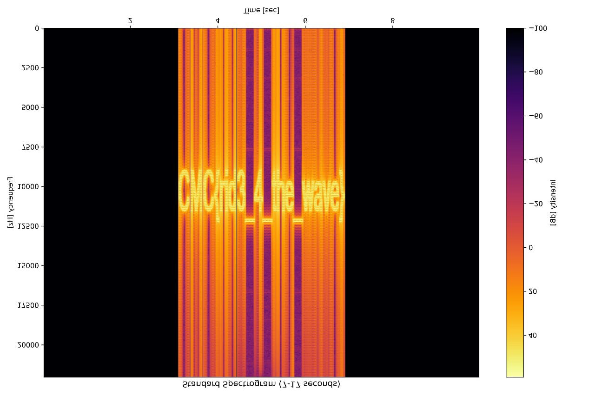

### Challenge Details

* **Category**: Misc
* **Difficulty**: Easy

An unassuming QR code surfaces during your late‑night wanderings through the neon-lit alleyways of the digital city. What appears to be a simple gateway to another world conceals a deeper secret—one that resonates beyond the pixels themselves.

Can you pierce the veil of silence and uncover what lies just… behind the QR?

### Requirements

* Attention to detail
* Ability to investigate QR codes & explore audio files

Flag format: `CMC{}`

---

*Author: xtle0o0*

## Solution Guide

### Step 1: QR Code Analysis
The challenge begins with a QR code that, when scanned, reveals a base64 encoded string. Decoding this string leads to a MediaFire link.

### Step 2: Audio Analysis
After downloading the audio file from MediaFire, we discover it contains:
- 00:01 to 00:07: "PSY - GANGNAM" song
- 00:08 to 00:17: Strange audio segment
- After 00:17: The song continues

### Step 3: Spectrogram Analysis
The flag is hidden in the spectrogram of the audio file. We can analyze it using:
1. Online tools like https://www.dcode.fr/spectral-analysis
2. Custom Python 

### Implementation
Two Python scripts were created to analyze the audio:

1. `1stage.py`: Analyzes the entire audio file and creates:
   - Standard spectrogram
   - High-contrast spectrogram (better for spotting hidden text)

2. `2stage.py`: Focuses specifically on the 7-17 second segment where the "weird stuff" plays, creating:
   - Standard spectrogram of the segment

final image rotated :

### Flag
The flag is revealed in the spectrogram of the audio file, specifically in the segment between 7-17 seconds. The spectrogram needs to be rottated.

Flag: `CMC{rid3_4_the_wave}` 