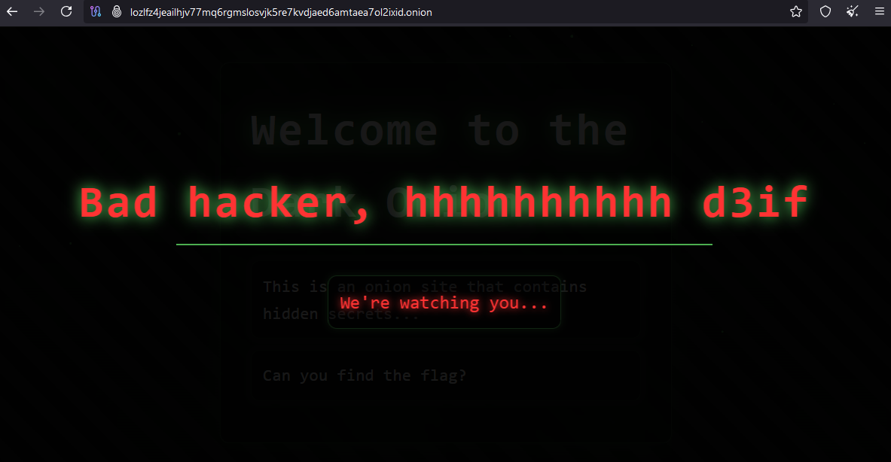
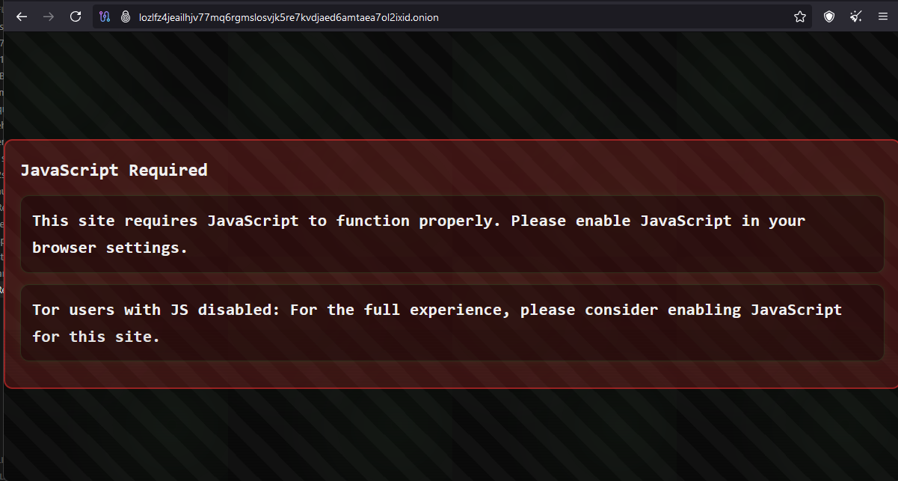
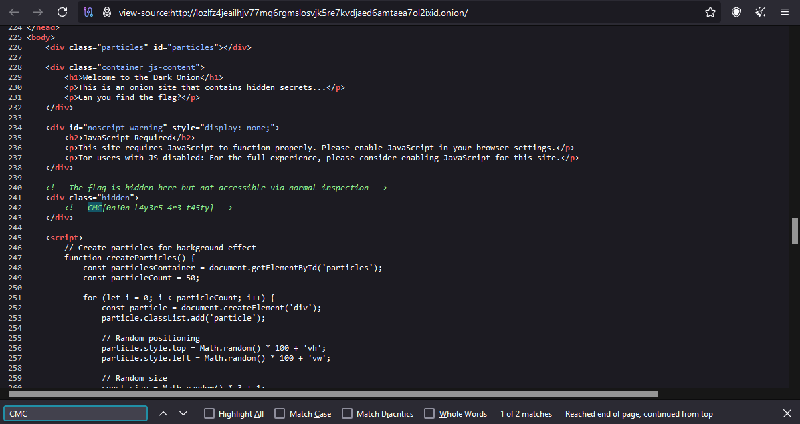

## Challenge Description

### Overview
A mysterious hidden service on the Tor network contains a flag, but normal inspection methods are disabled. Navigate the layers of protection to find what's hidden within.

### Challenge Details
- **Category**: Misc
- **Difficulty**: Easy
- **Flag Format**: `CMC{}`

### Requirements
- Tor Browser
- Knowledge of alternative source viewing methods
- No onion cutting skills required


*Author: xtle0o0*

---

## Solution Guide

### Step 1: Initial Access
Accessing the provided URL using Tor Browser reveals the challenge interface:


### Step 2: Inspection Attempts
Attempting to use standard inspection methods (Ctrl+U or F12) triggers the site's protection:


### Step 3: JavaScript Disabling
Disabling JavaScript return this:


### Step 4: Source Code Analysis
You can either:
- Use the view-source protocol directly: `view-source:http://lozlfz4jeailhjv77mq6rgmslosvjk5re7kvdjaed6amtaea7ol2ixid.onion/`
- Or access the source code after disabling JavaScript

### Step 5: Flag Discovery
Searching for 'CMC' in the page source reveals the hidden flag:


### Flag
```CMC{0n10n_l4y3r5_4r3_t45ty}```