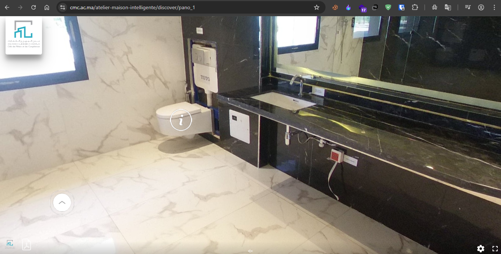

## Challenge Details
- **Category**: OSINT
- **Difficulty**: Easy

## Description
I forget my name's written in a house at CMC Agadir. Can you remind me what it is?
Think smart, think… SMAAART.

## Requirements
- Attention to detail
- Ability to investigate images/videos & explore visual clues

**Flag format:** CMC{NAME}

---

*Author: Gh000st12*

---

## Solution

### Step 1: Understanding the Challenge

The challenge name "SMAAART" and the description suggest we need to look for something related to a "smart" house at CMC Agadir.

### Step 2: Exploring the CMC Agadir Virtual Tour

The CMC Agadir campus has a 360° virtual tour tool available on their website (cmc.ac.ma). This tool allows visitors to explore the campus facilities virtually.

### Step 3: Finding the Smart House

By navigating through the 360° tour section, we can locate a facility called "Smart House" on the campus. This matches the hint in the challenge name.

### Step 4: Searching for a Name

Looking at the flag format (CMC{NAME}), we need to find a 4-letter name written somewhere in the Smart House.

Upon thorough examination of the Smart House, we discover that the only branded item with a visible name is in the smart bathroom - a toilet seat branded "TOTO":

### Step 5: Constructing the Flag

The name found is "TOTO", which matches the requirement for a 4-letter name.

Flag: `CMC{TOTO}`
