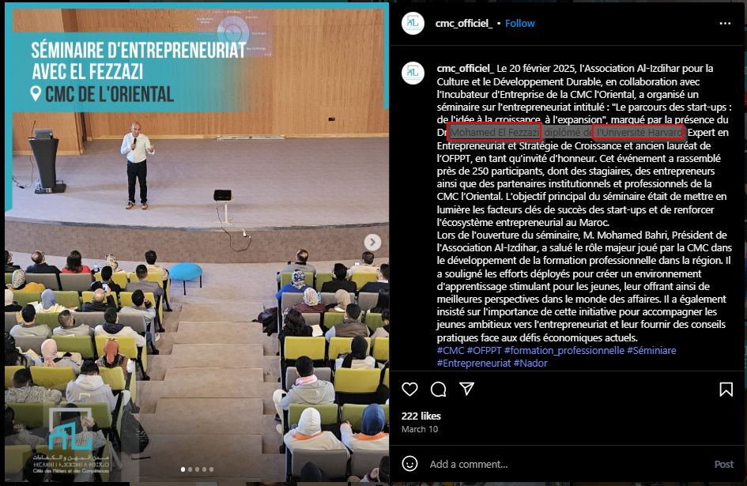
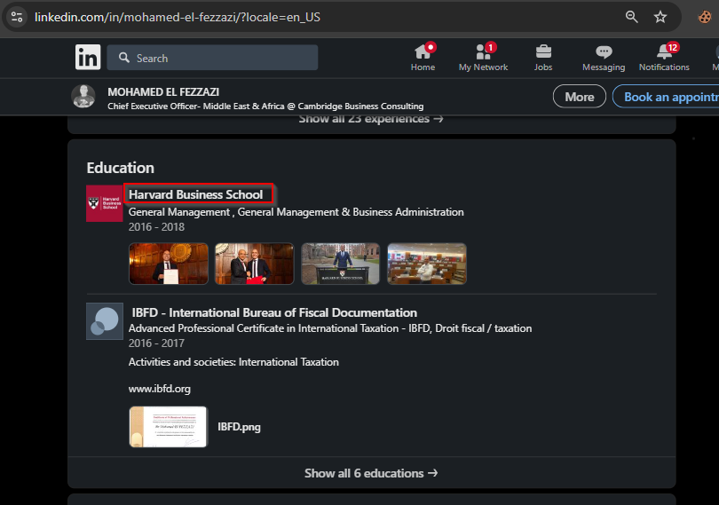

### Challenge Details

* **Category**: OSINT
* **Difficulty**: Easy

In March, CMC hosted an expert in entrepreneurship — someone with an impressive academic background. Your mission: find out who this person was and where they studied.

Clues are likely buried in news posts, social media, or event recaps. Can you track down the name of the expert and the university they graduated from?

### Requirements

* Internet research skills
* Familiarity with verifying public event info

Flag format: CMC{name_university}\
All lower case

---

*Author: Gh000st12*

---

solve:

constructing possible flag:

`CMC{mohamedelfezzazi_harvardbusinessschool}`

