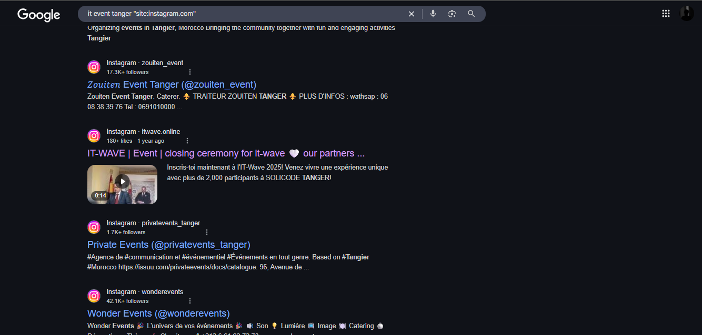
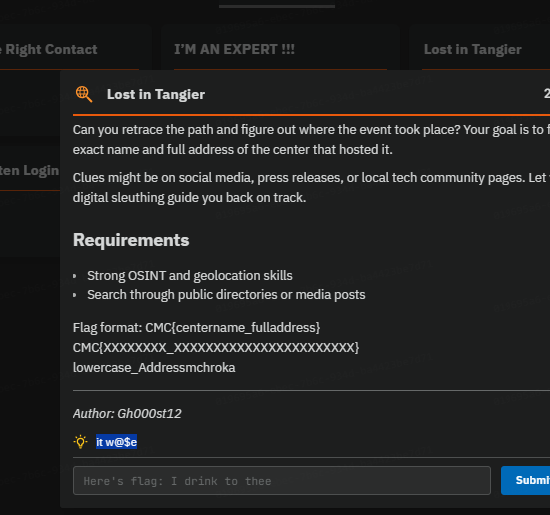
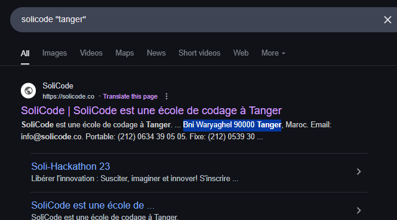

## Challenge Details
- **Category**: OSINT
- **Difficulty**: Medium

## Description
An exciting IT event recently created a buzz in Tangier — and you were all set to attend. But somewhere along the way, you got lost…

Can you retrace the path and figure out where the event took place? Your goal is to find the exact name and full address of the center that hosted it.

Clues might be on social media, press releases, or local tech community pages. Let your digital sleuthing guide you back on track.

## Requirements
- Strong OSINT and geolocation skills
- Search through public directories or media posts

**Flag format:** CMC{centername_fulladdress}  
*Example format:* CMC{XXXXXXXX_XXXXXXXXXXXXXXXXXXXXXXX}  
*Note:* Use lowercase for the center name and address with no spaces

---

*Author: Gh000st12*

---

## Solution

### Step 1: Identifying the Event Name

There are two effective methods to discover the name of the IT event in Tangier:

#### Method 1: Google Dorking
Using a targeted search query such as `it event tanger "site:instagram.com"` helps narrow down relevant social media posts about IT events in Tangier.

#### Method 2: Following Challenge Hints
During the competition, a hint was provided that helped point participants in the right direction:

From both methods, we determine that the event name is **IT Wave**.

### Step 2: Finding the Venue Location

After identifying the event name, we examine the IT Wave Instagram page. By reviewing their posts, we can see that the event was hosted at the **Solicode Center**.

This gives us the first part of our flag: `solicode`

### Step 3: Determining the Complete Address

Further investigation of the IT Wave social media reveals the full address of the Solicode Center:

The complete address is: **Bni Waryaghel 90000 Tanger, Maroc**

### Step 4: Constructing the Flag

Following the specified format, we combine the center name and address (removing spaces and keeping it lowercase):

Flag: `CMC{solicode_BniWaryaghel90000TangerMaroc}`

