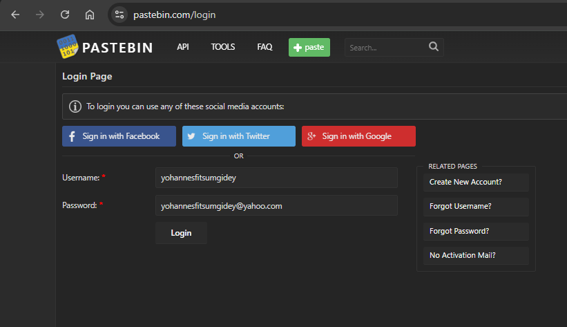

### Challenge Details

* **Category**: OSINT / Web Exploitation
* **Difficulty**: Medium

A notoriously careless developer, known by the handle **yohannesfitsumgidey**, has made a critical security mistake: his password is the same as his email address.

Your task is to:

1. Track down his digital footprint.
2. Identify and access the correct online platform using his handle as both the email and password. ( username : yohannesfitsumgidey , password : email )
3. Once logged in, explore the private area and uncover the hidden flag.

Can you exploit his laziness and gain access to what he thought was safe?

### Requirements

* OSINT investigation skills
* Creative thinking and persistence

Flag format: CMC{…}
Be respectful — this is a simulation for training purposes only.

---

*Author: xtle0o0*

---

## Solution

This challenge requires us to identify where the user "yohannesfitsumgidey" has an online presence and to determine his email address, which is also his password.

### Step 1: Initial Research

First, we need to search for the username "yohannesfitsumgidey" across various platforms. This can be done using OSINT tools or manual searches.

A common first stop is GitHub, where many developers maintain repositories. Searching there reveals a profile:

However, this appears to be a misdirection. The GitHub repository is empty, and there's a message mocking those attempting to find information there.

### Step 2: Expanding the Search

We need to scan other platforms where developers commonly share code or information. This includes:
- Pastebin
- GitLab
- Stack Overflow
- Twitter/X
- Reddit
- Other coding forums

### Step 3: Discovering the Correct Platform

After thorough investigation, a Pastebin account with the username "yohannesfitsumgidey" is discovered. There's a public paste where the user is laughing at participants, confirming we're on the right track.

### Step 4: Determining the Email Domain

The challenge indicates the password is the same as the email address. We know the username is "yohannesfitsumgidey", but we need to determine the email domain.

After testing common email domains, we discover the email is:
`yohannesfitsumgidey@yahoo.com`

### Step 5: Accessing the Account

Using the information gathered, we can now log in to the Pastebin account:
- Username: yohannesfitsumgidey
- Password: yohannesfitsumgidey@yahoo.com

### Step 6: Finding the Hidden Flag

Once logged in, we explore the account and discover a private paste that wasn't visible to the public.

The private paste contains a Base64 encoded string. Decoding this string reveals the flag:

Flag: `CMC{N0_p4ssw0rd_1s_s4f3}`

This challenge demonstrated the importance of:
1. Thorough OSINT investigation across multiple platforms
2. Not falling for obvious misdirections
3. Testing multiple email providers when guessing email addresses
4. Understanding how access to private information changes once authenticated

---

