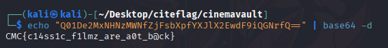

## Challenge Details
- **Category**: Reverse Engineering
- **Difficulty**: Easy

## Description
CinemaVault is a Python bytecode reverse engineering challenge themed around classic movies. Your mission is to break into the vault containing iconic movie quotes by reverse engineering the compiled bytecode file and extracting the secret flag hidden within.

## Requirements
- Python bytecode analysis skills
- Decompiler/disassembler knowledge
- Understanding of common encoding/encryption methods
- Advanced reverse engineering skills


## Solution

1. Decompile the `cinema_vault.cpython-312.pyc` file using an online tool such as [pylingual.io](https://pylingual.io)
2. Examine the decompiled Python code to find the following function:

```python
def _get_vault_content(self):
    flag_parts = ['Q01De2MxN', 'HNzMWNfZ', 'jFsbXpf', 'YXJlX2', 'EwdF9', 'iQGNrfQ==']
    return ''.join(flag_parts)
```

3. The flag is encoded in Base64. Joining and decoding these parts reveals the flag:



flag: `CMC{c14ss1c_f1lmz_are_a0t_b@ck}`
---

*Author: xtle0o0*
