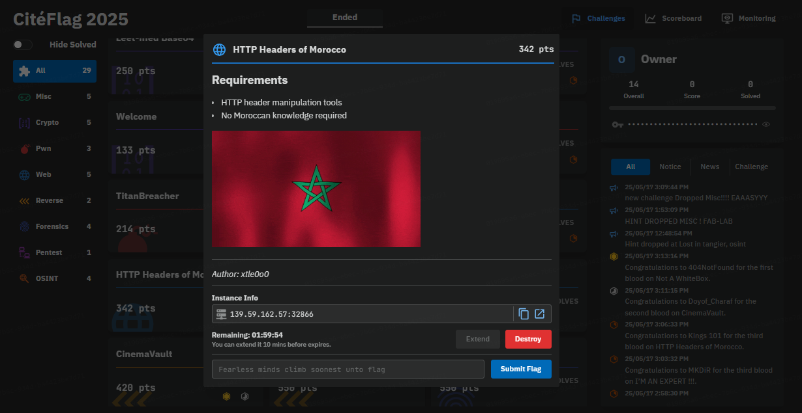
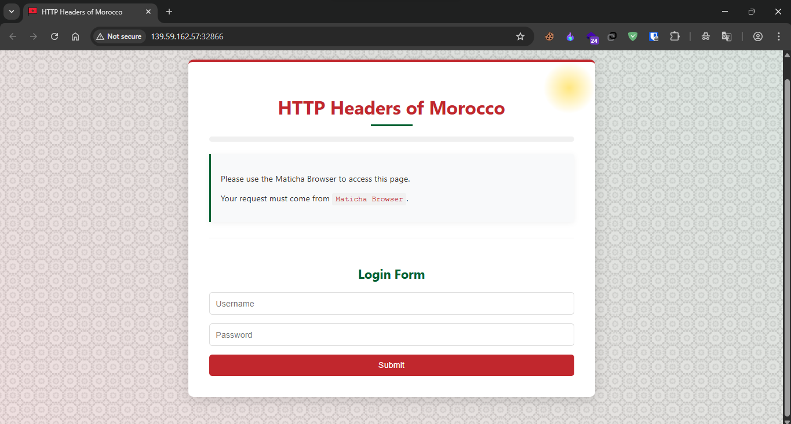

## Challenge Details
- **Category**: Web
- **Difficulty**: Medium

## Description
A Moroccan web service that requires specific HTTP headers to access. Configure your request headers correctly to bypass each layer of validation and retrieve the flag.

### Requirements
- HTTP header manipulation tools
- No Moroccan knowledge required


---

*Author: xtle0o0*

---

## Solution

### Step 1: Setting Up the Container

First, we deploy the challenge container:



Accessing the site initially reveals:



The site indicates it only accepts "Maticha Browser" - this tells us we need to modify the User-Agent header.

### Step 2: Modifying User-Agent

Let's use curl for easier header manipulation:

```bash
curl -H "User-Agent: Maticha Browser" http://139.59.162.57:32866/
```

Response (progress: 20%):
```html
<div class="message">
    <p>Please set your browser language to include Arabic.</p>
    <div class="challenge-section">
        <p>Please set your browser language to include Arabic.</p>
        <p class="arabic">مرحباً! يجب أن تكون لغة متصفحك تتضمن العربية.</p>
        <p class="hint">Set the <code>Accept-Language</code> header to include "ar".</p>
    </div>
</div>
```

### Step 3: Adding Arabic Language Support

We need to add the Arabic language code to our request:

```bash
curl -H "User-Agent: Maticha Browser" -H "Accept-Language: ar" http://139.59.162.57:32866/
```

Response (progress: 40%):
```html
<div class="message">
    <p>Service is available only to visitors from Morocco.</p>
    
    <div class="challenge-section">
        <p>Please set <code>X-Moroccan-City</code> to a valid Moroccan city.</p>
        <div>
            <span class="badge">rabat</span>
            <span class="badge">marrakech</span>
            <span class="badge">tangier</span>
            <span class="badge">agadir</span>
            <span class="badge">fez</span>
            <span class="badge">casablanca</span>
        </div>
    </div>
</div>
```

### Step 4: Specifying a Moroccan City

Adding a Moroccan city to our headers:

```bash
curl -H "User-Agent: Maticha Browser" -H "Accept-Language: ar" -H "X-Moroccan-City: fez" http://139.59.162.57:32866/
```

Response (progress: 60%):
```html
<div class="message">
    <p>Please specify a traditional Moroccan dish.</p>
    <div class="challenge-section">
        <p>Please set <code>X-Moroccan-Dish</code> to a traditional Moroccan dish.</p>
        <div>
            <span class="badge">pastilla</span>
            <span class="badge">tajine</span>
            <span class="badge">harira</span>
            <span class="badge">couscous</span>
            <span class="badge">rfissa</span>
        </div>
    </div>
</div>
```

### Step 5: Adding a Traditional Moroccan Dish

Let's add a traditional Moroccan dish to our request:

```bash
curl -H "User-Agent: Maticha Browser" -H "Accept-Language: ar" -H "X-Moroccan-City: fez" -H "X-Moroccan-Dish: harira" http://139.59.162.57:32866/
```

Response (progress: 80%):
```html
<div class="message">
    <p>You must be referred from a Moroccan website.</p>
    <div class="challenge-section">
        <p>You must be referred from a Moroccan website.</p>
        <p class="hint">The <code>Referer</code> header should contain "morocco".</p>
    </div>
</div>
```

### Step 6: Setting the Referer Header

Adding a Moroccan website as the referer:

```bash
curl -H "User-Agent: Maticha Browser" -H "Accept-Language: ar" -H "X-Moroccan-City: fez" -H "X-Moroccan-Dish: harira" -H "Referer: morocco.ma" http://139.59.162.57:32866/
```

Response (progress: 90%):
```html
<div class="message">
    <p>Invalid timestamp. Please provide a valid Unix timestamp.</p>
    <div class="challenge-section">
        <p>Your device clock must be synchronized with Morocco time.</p>
        <p>Server current time (Unix timestamp):</p>
        <div class="timestamp-info">1747553803</div>
        <p class="hint">Set the <code>X-Morocco-Time</code> header to a Unix timestamp within 5 minutes of the server time.</p>
    </div>
</div>
```

### Step 7: Setting the Correct Timestamp

The server wants us to set a timestamp within 5 minutes of its current time. We'll use the timestamp provided by the server:

```bash
curl -H "User-Agent: Maticha Browser" -H "Accept-Language: ar" -H "X-Moroccan-City: fez" -H "X-Moroccan-Dish: harira" -H "Referer: morocco.ma" -H "X-Morocco-Time: 1747553803" http://139.59.162.57:32866/
```

Response (success - 100%):
```html
<div class="container">
            <div class="success-message">مبروك! (Congratulations!)</div>
            <div class="progress-container">
                <div class="progress-bar" style="width: 100%;"></div>
            </div>
            <div class="flag-display">
                CMC{M4t1ch4_4ND_H4r1r4_4R3_D3L1C10U5}
            </div>
            <p>You've successfully completed the HTTP Headers of Morocco Challenge!</p>
</div>
```

### Final Flag

**Flag**: `CMC{M4t1ch4_4ND_H4r1r4_4R3_D3L1C10U5}`

## Summary

This challenge required us to set several HTTP headers correctly to bypass authentication:
1. Changed User-Agent to "Maticha Browser"
2. Set Accept-Language to include Arabic ("ar")
3. Added X-Moroccan-City header with a valid city ("fez")
4. Added X-Moroccan-Dish header with a traditional dish ("harira")
5. Set Referer header to a Moroccan website ("morocco.ma")
6. Added X-Morocco-Time header with a valid timestamp

By properly configuring these headers, we were able to retrieve the flag.
