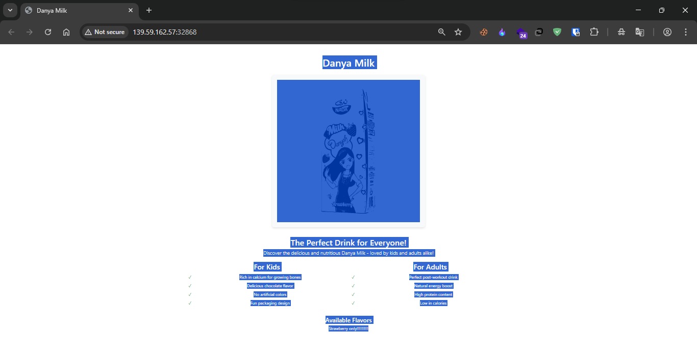
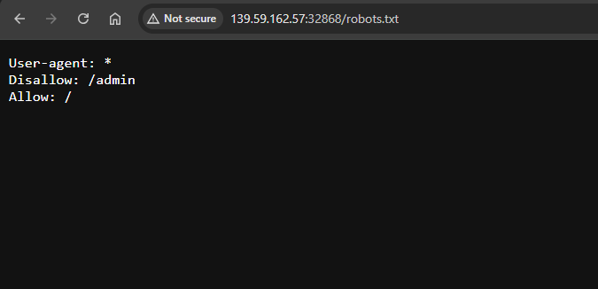
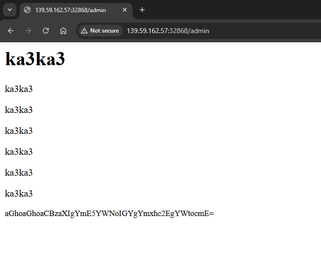
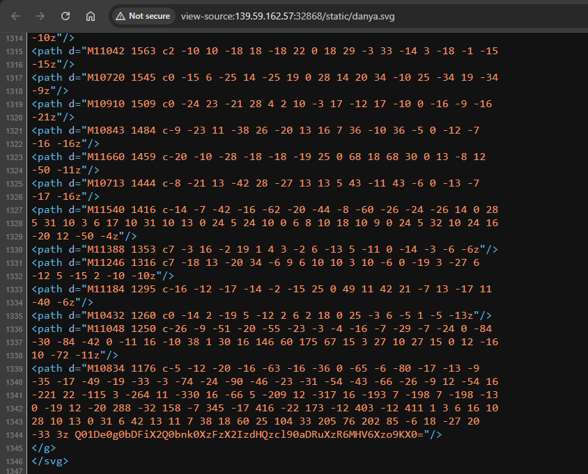

# Halib Danya

## Challenge Details
- **Category**: Web
- **Difficulty**: Easy

## Description
Halib danya is a mysterious web application with hidden secrets. Your mission is to explore the application, discover concealed routes, and decode the hidden messages to capture the flag.

### Requirements
- Web reconnaissance techniques
- Base64 decoding skills

### Important Note
Look carefully at the application files and hidden messages. Not everything is as it seems. Some secrets are hidden in plain sight, while others require deeper investigation.

### Challenge Overview

This CTF challenge focuses on web reconnaissance and discovery:

1. Part 1: Explore the visible application routes
2. Part 2: Discover hidden routes using web reconnaissance techniques
3. Part 3: Decode the obfuscated messages

---

*Author: xtle0o0* 

---

## Solution

### Step 1: Initial Reconnaissance

When accessing the site, we are presented with a simple webpage:

The page appears to be a standard webpage with no obvious clues in the visible content. After examining the source code, no immediate leads were found.

### Step 2: Checking for Common Hidden Files

A standard reconnaissance technique is to check for the presence of a `robots.txt` file, which often contains information about restricted areas of the website:

The `robots.txt` file reveals a hidden path that web crawlers are instructed not to index: `/admin`

### Step 3: Exploring the Hidden Admin Path

Navigating to the `/admin` path:

This page contains a Base64 encoded message. When decoded, it translates to: 
> "hhhhhhh sir ba9ach f blasa akhra"

suggesting we need to continue our investigation in a different direction.

### Step 4: Examining Page Assets

After reaching a dead end with the admin page and finding no useful information in response headers or HTML comments, we returned to examine the index page more carefully.

The main page contains an SVG image. SVG files are XML-based and can contain embedded data or comments. Upon examining the source code of this SVG image:

We discovered a Base64 encoded string hidden at the bottom of the SVG code.

### Step 5: Decoding the Hidden Flag

Decoding the Base64 string from the SVG file reveals the flag:

**Flag**: `CMC{H4l1b_d4ny4_1s_b3tt3r_th4n_4z0uz_:=)}`

## Summary

This challenge demonstrated several important web reconnaissance techniques:
1. Checking for common hidden files like `robots.txt`
2. Following leads to discover restricted paths
3. Examining page assets (like images) for hidden data
4. Using Base64 decoding to reveal concealed information

The key insight was recognizing that the SVG image on the main page wasn't just a visual element but contained hidden data within its XML structure.