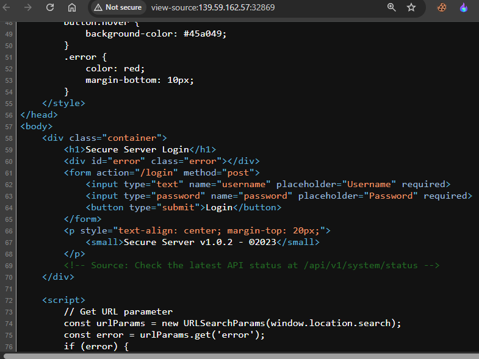
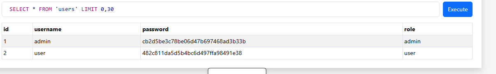
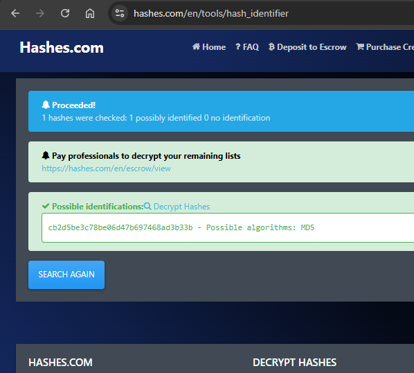
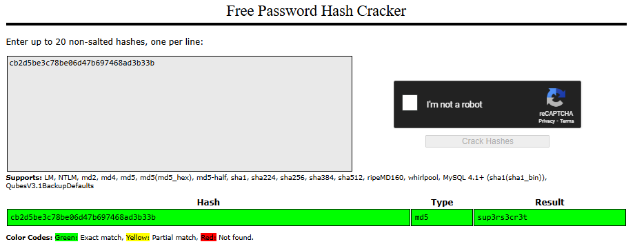
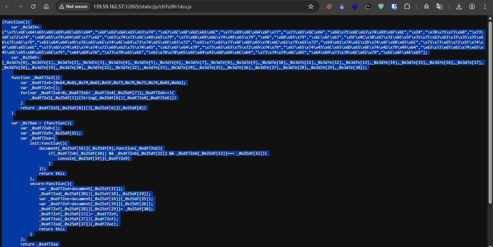
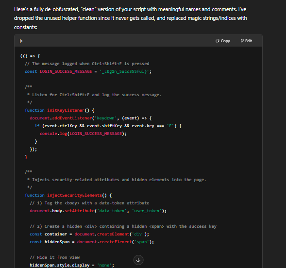

## Challenge Details
- **Category**: Web
- **Difficulty**: Medium

## Description
Not a WhiteBox is a mysterious web application containing multiple security vulnerabilities. The challenge involves exploring the application, discovering hidden endpoints, and elevating privileges to capture all parts of the flag.

## Requirements
- Web application testing skills
- Authentication bypass techniques
- API endpoint discovery
- Creative problem-solving


## Important Note
The application's database has been leaked and is available at:  
https://www.mediafire.com/file/jftf21rg1wmxph8/ctf.db/file

This leaked database contains valuable information to help solve the challenge.

## Login Credentials
- Regular user: `user` / `password123`

## Flag Format
The flag follows this format: `CMC{XXXXXX_XXX_XXXXXX_adminpassword_XXXXX_XXXXXXXXXX}`

## Challenge Overview
This CTF challenge has three parts to the flag that need to be discovered:

1. Part 1: Explore the application to find hidden functionality
2. Part 2: Bypass security restrictions to access privileged areas
3. Part 3: Combine your findings to capture the complete flag

---

*Author: xtle0o0*

---

## Solution Walkthrough

### Finding Part 1: Hidden API Functionality

First, I examined the index page source code:



In the HTML comments, I discovered a hidden API endpoint: `/api/v1/system/status`

Checking this endpoint with curl:

```
C:\Users\LEO>curl -lv http://139.59.162.57:32869/api/v1/system/status
*   Trying 139.59.162.57:32869...
* Connected to 139.59.162.57 (139.59.162.57) port 32869
* using HTTP/1.x
> GET /api/v1/system/status HTTP/1.1
> Host: 139.59.162.57:32869
> User-Agent: curl/8.12.1
> Accept: */*
>
* Request completely sent off
* HTTP 1.0, assume close after body
< HTTP/1.0 200 OK
< Content-Type: application/json
< Content-Length: 38
< X-Secret-Data: Q01De0gxZGQzbl9BUDFfSDM0ZDNyXw==
< Server: Werkzeug/2.0.1 Python/3.9.22
< Date: Sun, 18 May 2025 08:17:41 GMT
<
{"status":"online","version":"1.0.2"}
* shutting down connection #0
```

The API returned a JSON response and a secret header `X-Secret-Data` with value `Q01De0gxZGQzbl9BUDFfSDM0ZDNyXw==`.

Decoding this Base64 string revealed the first part of the flag: `CMC{H1dd3n_AP1_H34d3r_`

### Finding Part 2: Admin Password

Looking at the leaked database:



The passwords were hashed. Using a hash identifier, I determined they were MD5 hashes:



Using CrackStation to crack the admin hash:



The admin password was revealed to be `sup3rs3cr3t`.

### Finding Part 3: Hidden Flag in Dashboard

After logging in with admin credentials (admin/sup3rs3cr3t), I accessed the dashboard and inspected the source code. I found an encoded string and a reference to a JavaScript file:


The JavaScript file `static/js/chYiz8h1dcs.js` appeared to be obfuscated:



Deobfuscating the code revealed that pressing Ctrl+Shift+F would display the final part of the flag:



The final part of the flag was `_L0g1n_5ucc355ful}`.

## Complete Flag

Combining all three parts according to the format:

`CMC{H1dd3n_AP1_H34d3r_sup3rs3cr3t_L0g1n_5ucc355ful}`